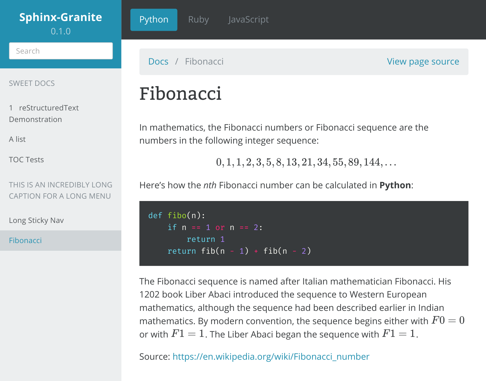

=======
Granite
=======

A `Sphinx <http://sphinx-doc.org/>` theme for API docs.

Example:

.. code-block:: rst

    =========
    Fibonacci
    =========

    In mathematics, the Fibonacci numbers or Fibonacci sequence are the numbers in
    the following integer sequence:

    .. math::

        0, 1, 1, 2, 3, 5, 8, 13, 21, 34, 55, 89, 144, ...

    .. container:: example python

        Here's how the `nth` Fibonacci number can be calculated in **Python**:

        .. code-block:: python

            def fibo(n):
                if n == 1 or n == 2:
                    return 1
                return fib(n - 1) + fib(n - 2)

    .. container:: example  ruby

        Here's how the `nth` Fibonacci number can be calculated in **Ruby**:

        .. code-block:: ruby

            def fibo(n)
                return n if n <= 2
                fibonacci(n - 1) + fibonacci(n - 2)
            end

    .. container:: example javascript

        Here's how the `nth` Fibonacci number can be calculated in **Javascript**:

        .. code-block:: javascript

            var fibo = function(n) {
                if(n <= 2) {
                    return 1;
                }
                return this.fibo(n - 1) + this.fibo(n - 2);
            };

    The Fibonacci sequence is named after Italian mathematician Fibonacci. His 1202
    book Liber Abaci introduced the sequence to Western European mathematics,
    although the sequence had been described earlier in Indian mathematics. By
    modern convention, the sequence begins either with :math:`F0 = 0` or with
    :math:`F1 = 1`. The Liber Abaci began the sequence with :math:`F1 = 1`.

    Source: https://en.wikipedia.org/wiki/Fibonacci_number

